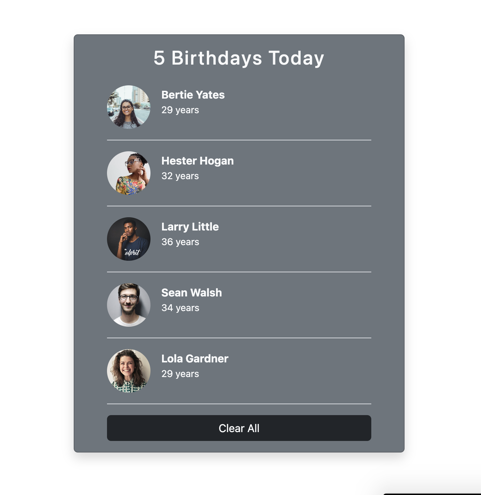
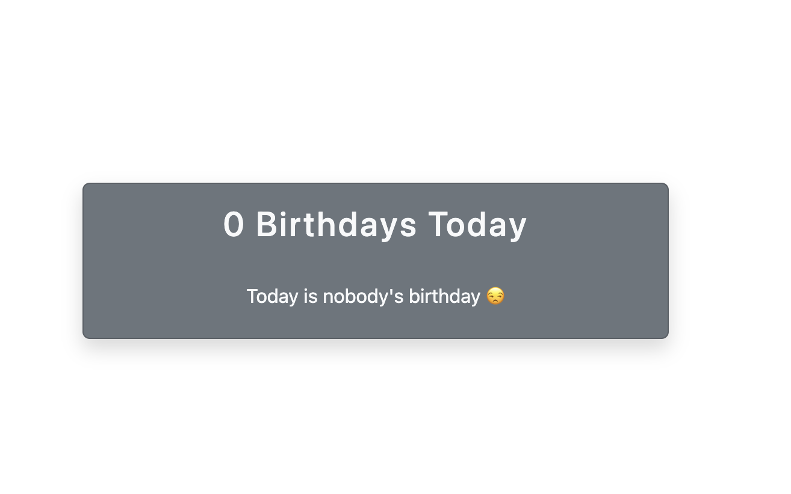

# MY REACT PROJECTS

The simple level projects I made by myself during the process of learning React.

### Libraries/Frameworks I use in my projects

- Boostrap
- Axios
- React Icons

### Project 1 - Birthday Reminder

[Click here](https://65f243c1b781d74fe2ddd8d2--incredible-gumdrop-40eb7d.netlify.app/) for the application link.

### Project 2 - Random User Generator

[Click here](https://65f227bd0171f33d9692b053--gilded-bonbon-c20ca2.netlify.app/) for the application link.

<small>2024 © Busra Tugul </small>
